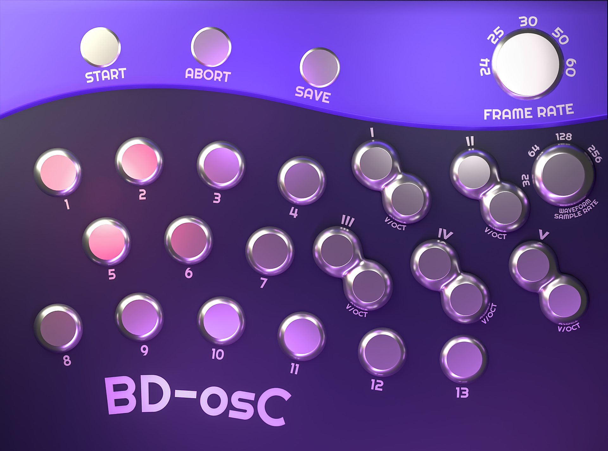

# BD-osC:
### A an animation keyframe recording module for VCV Rack

## Usage Guide

- There are 13 inputs useful for recording single values such as CV or loudness of an audio channel
- There are 5 waveform inputs for recording the shape of audio waveforms. Each audio input should be accompanied by its corresponding v/oct pitch CV so that the data does not produce a visual waveform that flickers in your animation program
- First, start the recording by triggering the "Start" input
- Next, either discard the current recording by triggering the "Abort" input or save it to disk by triggering the "Save" input
- Upon triggering the "Save" input, 6 files will be saved to the same directory as currently loaded patch. One for the *all* of the 16 single-value inputs and one for *each* of the waveform inputs.

## Structure of Output Files

### keyframes.csv

- Each column represents each one of the single value inputs from 1 -> 13, each row is a keyframe. The earliest keyframe is in the first row.

### waveform_*x*_keyframes.csv

- Each row is a keyframe for this waveform's shape. It is a window into the signal being recorded. Earliest to latest.
- If the v/oct input is connected, the wave keyframe captures only one wavelength of the wave and begins sampling the wave at the same point in the cycle for each frame.
- TODO: If it is not connected. the samples in the keyframe will be spread out across the entire wave for the duration of this keyframe (1/24, 1/30, etc.)

### framerate.txt

- stores a single integer representing the framerate

## Import to Blender

- The script and project file in the [blender_files](./blender_files/) directory can be used to import the animation csv files into a blender project
- The 13 single-value tracks will be mapped to the Z position of 13 empty objects. This Z value can be copied as a driver to any other drivable value you'd like. It will also be mapped to 13 value nodes in a group node that can be copied to any geometry nodes tree (TODO: and shader node tree?). The outputs of this group node can be used to drive a procedural geeometry.
- Waveform files will be represented as a mesh with only verts and edges with a geometry nodes modifier that allows you to easily switch between seeing one keyframe at a time as a window into the signal (good for if you have the v/oct input connected) and seeing the entire signal traveling along the (x?) axis at a rate where the origin of the geometry is at the current keyframe's data. (TODO: wording)

## TODO
- handle low frequency waveforms (even) better (better interpolation would fix the jaggedness of low freq waveforms at high waveform sampling resoltion?)
- experiment with different ways of capturing the waveform other than most recent window (average, weighted avg, maybe diff scaling?)
	- give users the option to enable a smoother capture for each waveform? for all?
- devise, implement, and run a test to ensure the keyframer's sense of the current visual keyframe is not out of sync (esp over long runs)
